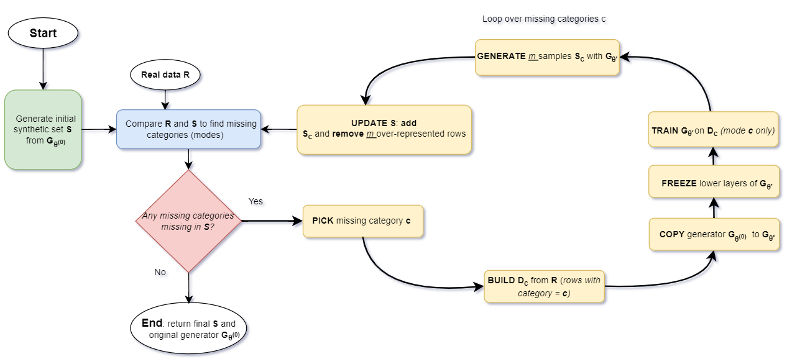

# PipelineTabularDataSynth

## Table of Contents
- [Project Overview](#project-overview)
- [Related Paper](#related-paper)
- [Documentation](#documentation)
- [Repository Structure](#repository-structure)
- [Quick Start](#quick-start)
- [Results & Large Artifacts](#results--large-artifacts)
- [License & Citation](#license--citation)




*Stage 1 of the pipeline: iterative layer-frozen mode-patching to restore dropped categorical modes. The full pipeline also includes a HEOM–kNN privacy filter and a three-layer evaluation protocol (fidelity, utility, privacy) — see the [paper (arXiv preprint)](https://arxiv.org/abs/2602.06390) or the thesis for full details.*


## Project Overview
PipelineTabularDataSynth is the experimental and evaluation artifact for the paper "Generating High-quality Privacy-preserving Synthetic Data." It provides a modular pipeline to generate synthetic tabular data (CTGAN/TVAE variants), apply model-agnostic post-processing, and evaluate fidelity, utility, and privacy across the Credit, Adult, and Cardio datasets. The core library lives in `src/`, and `PipelineBuilder` composes generation, post-processing, sampling/rejection, and evaluation tasks into repeatable workflows.

Post-processing components implemented here:
- Layer-frozen mode-patching for missing categorical levels.
- HEOM-kNN εANY rejection-with-replacement privacy filtering with threshold τANY.

Evaluation dimensions:
- Fidelity: JS distance, Cohen's d, dependence matrices.
- Utility: TSTR (train on synthetic, test on real).
- Privacy: DCR, RPR, CAP, AIA, Anonymeter (or equivalent).

Primary audience: researchers and engineers running synthetic-data experiments, plus reviewers who need to verify results without pulling all artifacts.

Heavy experiment artifacts are separated into the `pipeline_tabular_data_results/` submodule (Git LFS) hosted on Hugging Face to keep the codebase lightweight.

## Related Paper
**Title:** Generating High-quality Privacy-preserving Synthetic Data  
**Authors:** David Yavo, Richard Khoury, Christophe Pere, Sadoune Ait Kaci Azzou

This repository contains the experimental pipeline and evaluation artifacts for the paper (see the PDF provided with the review materials).

## Documentation
- [Setup & Reproducibility](docs/SETUP.md)
- [Reproduce the Paper](docs/REPRODUCE_PAPER.md)
- [Metrics Reference](docs/METRICS.md)
- [Datasets](docs/DATASETS.md)
- [Results & Git LFS](docs/RESULTS.md)
- [Results Storage Format](RESULTS_STORAGE.md)
- [GitHub Repository](https://github.com/dayav/pipeline_synthetic_tabular_data)
- [Hugging Face Results Dataset](https://huggingface.co/datasets/dayav/pipeline_tabular_data_results)

## Repository Structure
```
.
|-- docs/                          # Setup and reproducibility guidance
|-- src/                           # Core pipeline + evaluators
|-- experiments/                   # Scripts and notebooks (entry points)
|-- pipeline_tabular_data_results/ # Submodule: large artifacts (Git LFS)
|-- tests/                         # Unit tests
|-- requirements.txt               # Python dependencies
|-- setup.py                       # Package metadata
`-- RESULTS_STORAGE.md             # Results storage format + safety notes
```

Lightweight vs. heavy content:
- **Lightweight code:** `docs/`, `src/`, `experiments/`, `tests/`, `requirements.txt`, `setup.py`, `RESULTS_STORAGE.md`.
- **Heavy artifacts:** `pipeline_tabular_data_results/` (submodule; Git LFS; do not auto-download).

## Quick Start
> **Note**
> This quick start avoids large Git LFS downloads. For full setup, reproduction steps, and troubleshooting, see `docs/SETUP.md` and `docs/REPRODUCE_PAPER.md`.

```bash
GIT_LFS_SKIP_SMUDGE=1 git clone --recurse-submodules git@github.com:dayav/pipeline_synthetic_tabular_data.git
cd pipeline_synthetic_tabular_data
GIT_LFS_SKIP_SMUDGE=1 git submodule update --init --recursive
python3 -m venv .venv
. .venv/bin/activate
python -m pip install --upgrade pip
python -m pip install -r requirements.txt
python -m pip install -e .
./scripts/smoke_test.sh
```

## Results & Large Artifacts
All heavy experiment outputs live in the `pipeline_tabular_data_results/` Git submodule (Git LFS), pinned to a specific commit for reproducibility and hosted on Hugging Face. By default you will only have pointer files until you selectively pull the artifacts you need. See `docs/SETUP.md` for the full LFS workflow and the auto-generated task-to-results mapping.


## License & Citation

This project is released under the MIT License — see `LICENSE`.

For citations, use `CITATION.cff` (includes the paper citation, repository citation guidance, and results-submodule reference).

Citation guidance (research use):
- Cite the code repository by name (`PipelineTabularDataSynth`) and include the exact code commit SHA.
- Cite the results dataset submodule and include its commit SHA.
- Cite the related paper: "Generating High-quality Privacy-preserving Synthetic Data" (David Yavo, Richard Khoury, Christophe Pere, Sadoune Ait Kaci Azzou) - [arXiv:2602.06390](https://arxiv.org/abs/2602.06390)
- Submodule dataset URL (for reference): https://huggingface.co/datasets/dayav/pipeline_tabular_data_results
